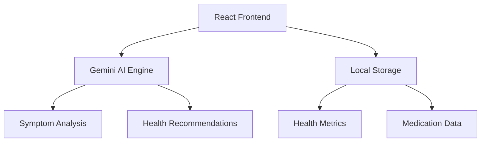

# 🌟 AI-Powered Health Assistant

<div align="center">

[](https://earnest-tartufo-fba144.netlify.app/)

[](https://earnest-tartufo-fba144.netlify.app/)
[](https://github.com/aryan1112003)
[](https://www.linkedin.com/in/aryan-acharya-9b939b316/)
[](LICENSE)
[](https://www.typescriptlang.org/)
[](https://reactjs.org/)

</div>

## 🎯 Overview

Welcome to the AI Health Assistant – your personal health companion powered by cutting-edge artificial intelligence. This revolutionary application combines Google's Gemini AI with an intuitive interface to deliver comprehensive health insights, personalized recommendations, and proactive wellness management.

### 🌟 Why Choose AI Health Assistant?

- 🤖 **AI-Powered Analysis**: Leverage Google's Gemini AI for accurate symptom evaluation
- 🎯 **Personalized Insights**: Get tailored health recommendations
- 📊 **Comprehensive Tracking**: Monitor multiple health metrics in one place
- 🔒 **Privacy-Focused**: Your health data stays secure and private
- 🎨 **Beautiful Interface**: Enjoy a clean, modern, and intuitive design

## ✨ Features Showcase

### 🔬 Smart Symptom Analysis
```typescript
// Example of AI-powered symptom analysis
const analysis = await analyzeSymptoms({
  symptoms: userSymptoms,
  aiModel: 'gemini-pro',
  confidenceThreshold: 0.8
});
```

### 📊 Health Metrics Dashboard
- **Activity Tracking**: Steps, distance, calories burned
- **Vital Signs**: Heart rate, blood pressure, temperature
- **Sleep Analysis**: Duration, quality, patterns
- **Nutrition**: Water intake, meal tracking, calories

### 💊 Smart Medication Management
- **Intelligent Reminders**: Never miss a dose
- **Drug Interaction Checks**: Stay safe with AI-powered verification
- **Prescription Tracking**: Digital record of all medications
- **Refill Alerts**: Timely reminders for prescription renewals

### 🧘 Mental Wellness Suite
- **Mood Tracking**: Monitor emotional well-being
- **Guided Meditation**: AI-curated mindfulness sessions
- **Stress Management**: Personalized relaxation techniques
- **Progress Analytics**: Track your mental health journey

## 🛠️ Technical Architecture



### Core Technologies
- **Frontend**: React 18 + TypeScript
- **Styling**: TailwindCSS
- **State Management**: React Context + Hooks
- **AI Integration**: Google Gemini AI
- **Build System**: Vite
- **Deployment**: Netlify

## 🚀 Getting Started

### Prerequisites
- Node.js 16+
- npm or yarn
- Google Gemini API key

### Installation Steps

1. **Clone & Install**
   ```bash
   git clone https://github.com/aryan1112003/ai-health-assistant.git
   cd ai-health-assistant
   npm install
   ```

2. **Environment Setup**
   ```bash
   # Create .env file
   cp .env.example .env
   
   # Add your Gemini API key
   echo "VITE_GEMINI_API_KEY=your_api_key_here" >> .env
   ```

3. **Development**
   ```bash
   npm run dev
   ```

4. **Production Build**
   ```bash
   npm run build
   npm run preview
   ```

## 📱 User Interface

<div align="center">
  
  <p><em>Modern, intuitive dashboard for health monitoring</em></p>
  
  
  <p><em>Comprehensive health tracking features</em></p>
</div>

## 🤝 Contributing

We believe in the power of community! Here's how you can contribute:

1. 🍴 Fork the repository
2. 🌿 Create your feature branch
   ```bash
   git checkout -b feature/AmazingFeature
   ```
3. 💫 Commit your changes
   ```bash
   git commit -m 'Add some AmazingFeature'
   ```
4. 📤 Push to the branch
   ```bash
   git push origin feature/AmazingFeature
   ```
5. 🎉 Open a Pull Request

## 📈 Future Roadmap

- [ ] Integration with wearable devices
- [ ] Advanced health analytics dashboard
- [ ] Telemedicine consultation features
- [ ] Community health challenges
- [ ] Multi-language support

## 👨‍💻 Author

<div align="center">
  
  <h3>Aryan Acharya</h3>
  <p>Full Stack Developer | AI Enthusiast | Health Tech Innovator</p>
  
  [](https://github.com/aryan1112003)
  [](https://www.linkedin.com/in/aryan-acharya-9b939b316/)
</div>

## 🌟 Support the Project

If you find this project helpful, please consider:
- ⭐ Starring the repository
- 🐛 Reporting bugs
- 💡 Suggesting new features
- 🤝 Contributing to the code

## 📄 License

This project is licensed under the MIT License - see the [LICENSE](LICENSE) file for details.

## 🙏 Acknowledgments

- Google Gemini AI team for the powerful AI capabilities
- The amazing React and TypeScript communities
- All our contributors and users
- Open source projects that inspired us

---

<div align="center">

### Made with ❤️ by [Aryan Acharya](https://github.com/aryan1112003)


<p align="center">
  <a href="https://earnest-tartufo-fba144.netlify.app/">Live Demo</a> •
  <a href="https://github.com/aryan1112003">GitHub</a> •
  <a href="https://www.linkedin.com/in/aryan-acharya-9b939b316/">LinkedIn</a>
</p>

© 2024 Aryan Acharya. All rights reserved.

</div>
